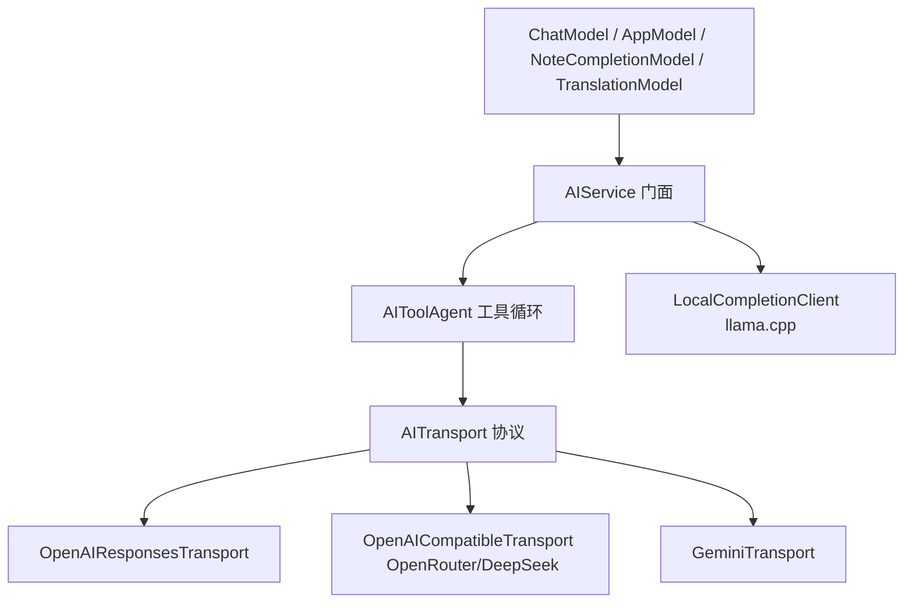

# AI 服务层统一设计（AIService Unification）

## 1. 现状问题

`AIService.swift`（781 行）目前：

- `answer` / `translate` / `chat` / `completeNote` 各自对四个 provider 写一套 `switch`，共 5 处重复分支。
- OpenAI、OpenRouter、DeepSeek、Gemini 的 payload、URL、鉴权头各自散落，`streamDelta` 里再按 provider 分一次。
- 工具调用只支持 DeepSeek 和 OpenRouter（`runToolAgent` 开头直接拒绝另外两个），OpenAI Responses 和 Gemini 的工具协议没有接入。
- `completeNote` 的本地 llama.cpp 逻辑和云端逻辑混在同一个类型里。

## 2. 目标结构



### 2.1 传输层协议

```swift
enum AIEndpoint: Sendable {
    case responses(baseURL: URL, apiKey: String, headers: [String: String])
    case chatCompletions(baseURL: URL, apiKey: String, headers: [String: String])
    case gemini(baseURL: URL, apiKey: String)
}

struct AIRequest: Sendable {
    var messages: [ChatMessage]
    var tools: [RiffTool]
    var temperature: Double
    var maxOutputTokens: Int?
    var reasoning: Bool        // 关闭思考
    var verbosity: String      // low
}

enum AIStreamEvent: Sendable {
    case text(String)
    case toolCallDelta(PendingToolCall)
    case error(String)
}

protocol AITransport: Sendable {
    var provider: AIProvider { get }
    func stream(_ request: AIRequest) -> AsyncThrowingStream<AIStreamEvent, Error>
}
```

每个 transport 只做两件事：把 `AIRequest` 翻译成该 provider 的 HTTP payload，把响应流归一化为 `AIStreamEvent`。所有流式解析、SSE 边界、HTTP 错误处理收敛到共享的 `SSEStreamReader`。

### 2.2 Provider 映射

| Provider | Transport | 端点 | 工具协议 |
| --- | --- | --- | --- |
| OpenAI | `OpenAIResponsesTransport` | `https://api.openai.com/v1/responses` | `function` 工具 |
| OpenRouter | `OpenAICompatibleTransport` | `https://openrouter.ai/api/v1/chat/completions` | `tool_calls` |
| DeepSeek | `OpenAICompatibleTransport` | `https://api.deepseek.com/chat/completions` | `tool_calls` |
| Gemini | `GeminiTransport` | `https://generativelanguage.googleapis.com/v1beta/models/...` | `functionCall` / `functionResponse` |

### 2.3 工具循环（AIToolAgent）

`runToolAgent` 从“只有两个 provider 可用”改为通用循环，所有 transport 都能返回 `toolCallDelta`：

1. 发送 `AIRequest(messages, tools)`。
2. 收集文本与工具调用；无工具调用则返回最终文本。
3. 执行工具（复用 `RiffToolRegistry`），把结果作为 `tool` 消息追加。
4. 最多 4 轮，超限报错。

OpenAI Responses 需要把工具调用映射为 `response.output_item.done` / `function_call` 事件，Gemini 需要把 `functionCall` 转成内部 `PendingToolCall`，再以 `functionResponse` 回填——这些差异全部封装在各自 transport 内，`AIToolAgent` 不感知 provider。

### 2.4 AIService 门面

`AIService` 保留现有公开方法签名（`answer`、`answerWithTools`、`translate`、`chat`、`chatWithTools`、`completeNote`），内部改为：

```swift
private func transport(for provider: AIProvider) -> AITransport
```

门面负责组装 prompt、选择 transport、决定是否走工具循环，不再出现 provider `switch`。

### 2.5 本地补全

`completeNote` 的 `.local` 分支拆成独立的 `LocalCompletionClient`（保留现有 llama.cpp `/v1/chat/completions` 协议与 `NoteCompletionServiceConfiguration`），`AIService` 只负责云端。

## 3. 文件布局

```text
Sources/Riff/Services/AI/
  AIEndpoint.swift
  AIRequest.swift
  AIStreamEvent.swift
  AITransport.swift
  SSEStreamReader.swift
  OpenAIResponsesTransport.swift
  OpenAICompatibleTransport.swift
  GeminiTransport.swift
  AIToolAgent.swift
  LocalCompletionClient.swift
Sources/Riff/Services/AIService.swift   # 保留为门面，体积应降到 ~150 行
```

## 4. 测试计划

- `AITransportTests`：每个 transport 用本地 HTTP stub（`URLProtocol`）验证 payload 形状、鉴权头、事件归一化。
- `AIToolAgentTests`：伪造 transport 返回 `toolCallDelta`，验证工具执行与回填、轮数上限、取消。
- `AIServiceStreamingTests`：保留现有流式测试，补充 Gemini/OpenAI 工具调用场景。
- 快照行为不变：翻译、回答、笔记补全的提示词不做任何改动。
