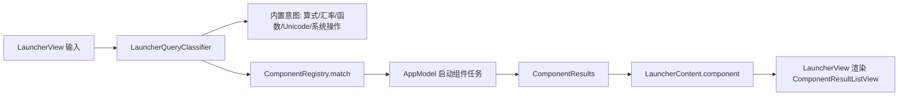

# 组件系统设计（Component System）

## 1. 目标

Riff 现在把“应用启动、剪贴板、随机密码、笔记、翻译、AI 对话”等能力散落在 `LauncherMode`、`LauncherQuickAction`、`PanelControllers` 和各 Model 里。缺少一个统一的“组件”概念。

本设计的目标：

- 用统一的组件模型表达所有用户可见的功能表面（launcher 结果、快捷操作、面板）。
- 组件由 `ComponentManager` 统一注册、启用/停用、排序、计费（使用统计）和展示。
- 内置组件走原生 Swift 协议；第三方组件依据公开规范开发，用户可安装/更新/卸载，不需要重新编译 Riff。
- 第三方组件默认受限：进程隔离、声明式权限、超时与输出上限，避免“安装一个组件 = 给应用开一个洞”。

## 2. 核心概念

### 2.1 ComponentDescriptor（描述符）

```swift
struct ComponentDescriptor: Codable, Equatable, Sendable {
    var id: String            // "dev.rhythmicc.password"，全局唯一
    var name: String          // 显示名，如 "随机密码"
    var version: String       // 语义化版本
    var author: String
    var keywords: [String]    // launcher 关键词，如 ["密码", "password", "pwgen"]
    var surfaces: Set<ComponentSurface>  // launcher / panel / settings
    var permissions: Set<ComponentPermission> // network / pasteboard / files / keychain
    var icon: ComponentIcon   // systemName 或资产路径
}
```

### 2.2 RiffComponent（原生协议，内置组件）

```swift
protocol RiffComponent: Identifiable, Sendable {
    var id: String { get }
    var descriptor: ComponentDescriptor { get }

    /// 查询是否命中该组件；返回匹配优先级（0 为不匹配）。
    func matchPriority(for query: String, mode: LauncherMode) -> Int?

    /// 返回 launcher 结果。必须可取消、可并发。
    func results(for query: String) async throws -> ComponentResults

    /// 执行结果项上的动作（复制、打开、进入面板等）。
    func perform(_ action: ComponentAction) async throws

    /// 可选：组件自己的面板内容。
    @MainActor var panelController: (any ComponentPanel)? { get }
}
```

结果模型：

```swift
struct ComponentResults: Sendable {
    var items: [ComponentResultItem]
    var isComplete: Bool          // false 表示仍在加载
}

struct ComponentResultItem: Identifiable, Sendable {
    var id: String
    var title: String
    var subtitle: String?
    var icon: ComponentIcon?
    var actions: [ComponentAction]
}

enum ComponentAction: Sendable {
    case copy(String)
    case openURL(URL)
    case callback(id: String, payload: [String: String])  // 交给组件自己处理
    case openPanel(panelID: String)
}
```

### 2.3 组件注册表与管理器

```swift
/// 只负责发现：内置 + 已安装目录扫描。
final class ComponentRegistry {
    func allComponents() -> [any RiffComponent]
    func builtInComponents() -> [any RiffComponent]
    func installedComponents() -> [InstalledComponent]
}

/// 唯一的状态持有者，供 AppModel / SettingsView 使用。
@MainActor
final class ComponentManager: ObservableObject {
    @Published private(set) var enabledIDs: Set<String>
    @Published private(set) var installed: [InstalledComponent]

    func match(_ query: String, mode: LauncherMode) -> ComponentMatch?
    func enable(_ id: String)
    func disable(_ id: String)
    func install(from url: URL) async throws   // 校验 manifest、复制到组件目录
    func update(_ id: String, from url: URL) async throws
    func uninstall(_ id: String) throws
}
```

- `ComponentManager` 是 App 层唯一入口；`AppModel`、`LauncherView`、`SettingsView` 都不直接接触组件目录。
- 启用状态存 UserDefaults（`components.enabled`），安装清单存 `~/Library/Application Support/Riff/Components/`。
- 组件命中按 `keywords` + 描述符优先级排序；结果由 `ComponentRegistry` 并行调用，全部返回后按组件优先级合并。

## 3. Launcher 集成

### 3.1 查询流



1. `LauncherQueryClassifier` 先走现有内置意图（图形/Unicode/密码/算式/汇率/系统操作），全部不命中再查 `ComponentRegistry`。
2. 新增 `LauncherContent.component(componentID:query:results:isLoading:)` 与 `LauncherContentKind.component`。
3. `AppModel` 持有 `componentManager`，组件查询任务与其他异步任务一样：进入时 `cancelPendingWork()`，结果回来校验 `state.query` 仍匹配。
4. `LauncherView` 新增 `ComponentResultListView`，只渲染 `ComponentResultItem`，不做业务逻辑。
5. 激活动作统一走 `AppModel.activateSelection()` → `ComponentActionRunner`；`copy/openURL` 直接执行，`callback` 转交组件，`openPanel` 通知 `AppDelegate` 打开对应面板。

### 3.2 现有功能迁入（第一阶段）

内置组件注册表第一批：

| 组件 id | 来源 | 表面 |
| --- | --- | --- |
| `dev.rhythmicc.apps` | `LauncherMode.apps` | launcher |
| `dev.rhythmicc.clipboard` | `LauncherMode.clipboard` + `ClipboardStore` | launcher + panel |
| `dev.rhythmicc.password` | `LauncherMode.password` + `PasswordGenerator` | launcher |
| `dev.rhythmicc.note` | `LauncherQuickAction.note` + `NoteModel` | launcher + panel |
| `dev.rhythmicc.translation` | `TranslationModel` | launcher + panel |
| `dev.rhythmicc.chat` | `ChatModel` | launcher + panel |
| `dev.rhythmicc.system-operations` | `SystemOperationExecutor` | launcher |

迁移时保持外部行为不变：`LauncherMode` 仍存在，但内部实现改为“选中某个组件模式”；`LauncherQuickAction` 改为组件关键词的快捷入口。此阶段不引入第三方组件，先让 `ComponentManager` 跑通内置注册、启用/停用和设置页展示。

## 4. 第三方组件规范（v1）

### 4.1 形态

第三方组件是一个目录（可打包为 `.riffcomponent` zip）：

```text
<component-id>/
  manifest.json
  bin/run          # 可执行文件（shell / python / swift script 等）
  assets/          # 图标等静态资源
  README.md        # 可选
```

安装位置：`~/Library/Application Support/Riff/Components/<component-id>/`。

### 4.2 manifest.json

```json
{
  "schema_version": 1,
  "id": "dev.example.weather",
  "name": "天气",
  "version": "1.0.0",
  "author": "Example Dev",
  "icon": "assets/icon.png",
  "keywords": ["天气", "weather"],
  "executable": "bin/run",
  "permissions": ["network", "pasteboard"],
  "timeout_ms": 5000,
  "surfaces": ["launcher"]
}
```

校验规则：

- `id` 必须符合反向域名格式，且目录名与 `id` 一致。
- `executable` 必须位于组件目录内（禁止绝对路径和 `..`）。
- `permissions` 只允许枚举值：`network`、`pasteboard`、`files`、`keychain`。
- 版本号必须语义化；重复安装同 `id` 视为更新，先备份旧目录。

### 4.3 运行协议（JSONL over stdio）

Riff 以子进程方式启动 `bin/run`，通过 stdin 发送 JSON 行，从 stdout 读取 JSON 行：

请求：

```json
{"request": "query", "query": "北京 天气"}
{"request": "action", "action_id": "copy-result", "item": {"id": "1"}}
{"request": "cancel"}
```

响应：

```json
{"results": [{"id": "1", "title": "北京 25°C", "subtitle": "晴", "actions": [{"id": "copy", "title": "复制", "kind": "copy"}]}], "isComplete": true}
{"result": "ok", "payload": "已复制"}
```

### 4.4 安全边界（v1）

- 每个组件一个子进程，最长存活一个查询；`timeout_ms` 到点即 `terminate()`。
- stdout 累积上限（默认 1 MB），超限杀进程。
- 未声明 `network` 的组件，由 Riff 在启动进程时设置 `RIFF_NETWORK=0` 环境变量；v1 不强制内核级沙箱，但设置页明确展示权限并提示风险。
- 组件不得直接读写剪贴板之外的文件；`files` 权限只允许读写 `~/Library/Application Support/Riff/Components/<id>/data/`。
- 安装时校验 zip 路径穿越（entry 不得包含 `..`）。
- 更新/卸载前自动备份到 `Components/.trash/<id>-<timestamp>/`，保留 7 天。

### 4.5 设置页

`SettingsView` 新增“组件”分区：

- 已安装列表：名称、版本、作者、启停开关、权限标签。
- 操作：检查更新（重新下载安装）、卸载、打开组件目录、手动安装（文件选择器或拖拽）。
- 内置组件只显示启停，不显示卸载。

## 5. 文件布局（实施后）

```text
Sources/Riff/
  Components/
    ComponentDescriptor.swift
    RiffComponent.swift
    ComponentManager.swift
    ComponentRegistry.swift
    ComponentActionRunner.swift
    Builtin/
      AppsComponent.swift
      ClipboardComponent.swift
      PasswordComponent.swift
      NoteComponent.swift
      TranslationComponent.swift
      ChatComponent.swift
      SystemOperationsComponent.swift
    Script/
      ScriptComponentHost.swift
      ScriptComponentProtocol.swift
      InstalledComponentStore.swift
  UI/
    ComponentResultListView.swift
```

## 6. 测试计划

- `ComponentDescriptorTests`：manifest 校验（非法 id、路径穿越、未知权限、版本格式）。
- `ComponentRegistryTests`：内置组件发现、关键词去重、优先级排序。
- `ComponentManagerTests`：启停状态持久化、安装/更新/卸载、备份与回滚。
- `ScriptComponentHostTests`：JSONL 协议往返、超时杀进程、输出上限、取消。
- `LauncherArchitectureTests` 扩展：组件命中、结果过期校验（旧 query 不覆盖新 query）、激活动作路由。
